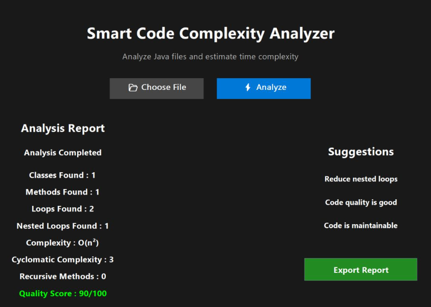

# Smart Code Complexity Analyzer

A Java desktop application built using Java Swing to analyze Java source code and estimate program complexity.

## Features

- Upload and analyze Java source files
- Detect classes and methods
- Count loops and nested loops
- Estimate time complexity:
  - O(1)
  - O(log n)
  - O(n)
  - O(n log n)
  - O(n²)
  - O(n³)
- Calculate Cyclomatic Complexity
- Detect recursive methods
- Generate code quality scores
- Provide required suggestions
- Export analysis reports

## Technologies Used

- Java
- Java Swing
- Object-Oriented Programming (OOP)
- File Handling

## Screenshots

### Home Screen

### Analysis Report

## Authors

- Tanisha Karthikeyan
- Prem Sai J S
